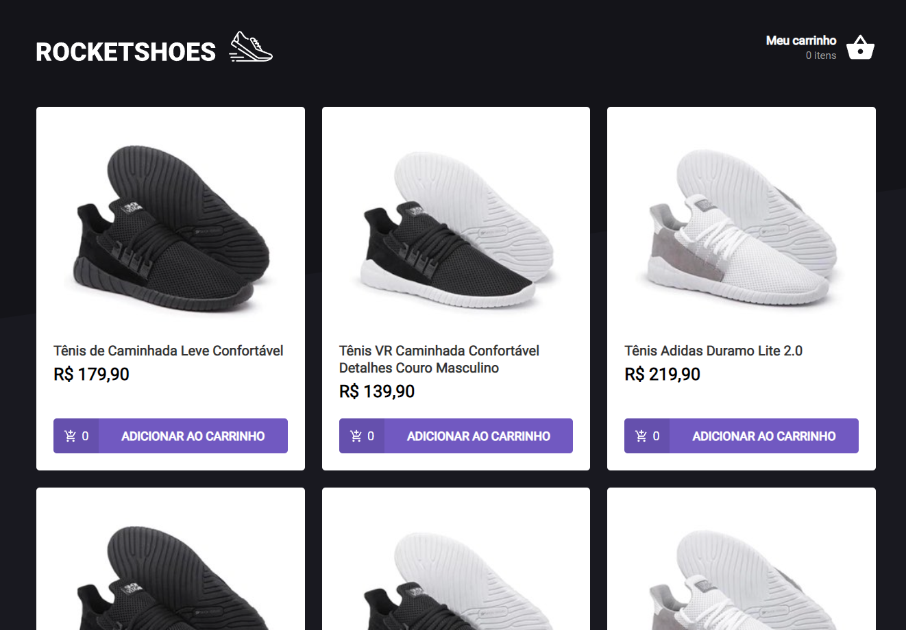

  

# 📖 About

**RocketShoes** is a web application, created to be a simple example of an e-commerce.

This project is part of a series of mandatory challenges to be completed on [Rocketseat's](https://www.rocketseat.com.br/) Ignite course, React trail.

The application developed in the course does not use MirageJS, but JSON Server, however, as I would like to host the application on Vercel, so that everyone could see the application in operation, I carried out this migration, the application continues to work the same the way it was originally developed during the course.

# 🔩 Technologies

- [React](https://react.dev/)
- [Create React App](https://create-react-app.dev/)
- [TypeScript](https://www.typescriptlang.org/)
- [Axios](https://axios-http.com/)
- [MirageJS](https://miragejs.com/)
